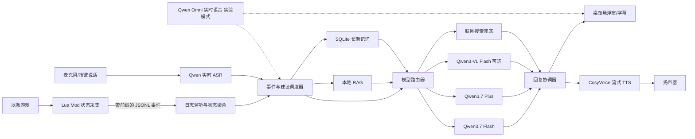

# Oriens: Your In-Game Guide — 项目计划

> 文档状态：阶段 2 本地 RAG v2
> 更新日期：2026-08-12
> 当前阶段：阶段 2 `rag-v2.1` 完整本地语料已导入、索引、评测并验收；`rag-v1` 仍保留为可回滚基线
> 目标平台：Windows + Steam《The Binding of Isaac: Repentance+》  
> 项目形态：以撒 Lua Mod + Python/PySide6 桌面伴侣

## 1. 项目愿景

Oriens 是一个陪伴型《以撒的结合》游戏助手。它不仅回答攻略问题，还会理解当前局面、在合适的时机给出建议、通过语音与玩家交谈，并逐步记住玩家的习惯和偏好。

首版面向个人原型，优先验证以下体验：

1. 能从游戏 Mod API 获取足够准确的局内状态。
2. 不打断游戏节奏，只在真正有价值的时机发言。
3. 能通过按键说话与玩家进行低延迟语音交流。
4. 能基于以撒 Wiki 和社区攻略给出有依据的建议。
5. 能记住玩家的长期偏好，形成持续陪伴感。
6. 正常游玩成本控制在约 1–2 元/2 小时。

## 2. 已确认的产品决策

### 2.1 运行方式

- 游戏端：Lua Mod，只负责读取游戏状态、生成结构化事件。
- 桌面端：Python 3.11+、PySide6，负责模型调用、语音、RAG、记忆、设置和提示展示。
- 游戏内不保存云端 API Key，所有凭据只存在桌面端。
- 默认使用游戏接口，不默认读屏。
- 读屏是可选补充能力，只在状态 API 无法覆盖且玩家主动启用时使用。
- 默认语音方案为 STT → 文本模型 → TTS。
- 端到端实时语音作为实验开关，不作为默认模式。

### 2.2 模型配置

| 能力 | 模型 | 用途 |
|---|---|---|
| 日常陪玩 | `qwen3.7-flash` | 常规问答、短建议、陪伴对话、记忆总结 |
| 复杂决策 | `qwen3.7-plus` | 道具协同、路线规划、资源取舍、冲突资料判断 |
| 截图理解 | `qwen3-vl-flash` | 状态 API 缺失时分析局部截图，默认关闭 |
| 语音识别 | `qwen3-asr-flash-realtime` | 玩家实时语音转文字 |
| 语音合成 | `cosyvoice-v3.5-flash` | Oriens 的流式中文语音输出 |
| 实时语音 | `qwen3.5-omni-flash-realtime` | 实验性的端到端自然对话模式 |
| 长期记忆总结 | SQLite + `qwen3.7-flash` | 提取偏好、总结对局、压缩历史 |
| RAG 向量 | 本地 `BGE-M3` | Wiki 和社区攻略的中英文混合检索 |
| 攻略来源 | 本地 RAG 优先 | 联网搜索只在本地资料不足或需要更新信息时兜底 |

模型必须通过统一适配器调用，业务逻辑不得直接依赖某个具体模型 ID。后续可以在配置文件中替换模型或增加 DeepSeek 等后端，而不修改核心流程。

## 3. 总体架构



### 3.1 关键原则

- 不把每帧游戏状态直接发送给大模型。
- Lua 侧输出事实，Python 侧维护完整状态和历史。
- 先用确定性规则判断“是否值得打扰玩家”，再决定是否调用模型。
- 战斗中的毫秒级判断尽量由本地规则完成，不依赖云模型往返。
- 模型负责解释、权衡和表达，不负责猜测可由游戏 API 直接获得的事实。
- 所有建议都携带状态版本号；过期回复不得播放。

## 4. 游戏端 Lua Mod

### 4.1 职责

- 读取当前角色、生命、魂心、黑心、硬币、钥匙、炸弹和充能。
- 读取被动道具、主动道具、饰品、卡牌、胶囊和临时效果。
- 读取楼层、房间类型、房间编号、诅咒、Boss、交易房等信息。
- 读取可可靠获取的敌人、拾取物、道具底座和房间清理状态。
- 监听语义事件，而不是无条件输出每帧完整状态。
- 定期发送低频心跳和必要的状态快照，支持桌面端重建状态。

### 4.2 首版传输方式

使用 `Isaac.DebugString` 输出带固定前缀的单行 JSON：

```text
[ORIENS_EVENT]{"schema_version":1,"seq":184,"run_id":"...","type":"room_entered","payload":{...}}
```

Python 桌面端监听以撒日志，只解析 `[ORIENS_EVENT]` 前缀的行。

选择日志作为首版单向 IPC 的理由：

- 不依赖 Lua Mod 是否允许任意网络或文件访问。
- 容易调试和回放。
- AI 的文字与语音由桌面端展示，不要求桌面端反向控制游戏。

如果验证后发现日志延迟或轮转机制不能满足需求，再评估命名管道、本地 WebSocket 或受支持的文件桥接；在完成 API 探针前不预设这些方式可用。

### 4.3 事件类型

首版至少支持：

- `run_started`
- `run_ended`
- `floor_changed`
- `room_entered`
- `room_cleared`
- `player_state_changed`
- `inventory_changed`
- `collectible_spawned`
- `collectible_taken`
- `shop_state_changed`
- `deal_room_entered`
- `boss_started`
- `boss_defeated`
- `critical_health`
- `death`
- `heartbeat`
- `state_snapshot`

每条事件必须包含：

- `schema_version`
- 单调递增的 `seq`
- `run_id`
- 游戏帧或时间戳
- 当前楼层和房间标识
- 事件负载

### 4.4 输出节流

- 语义事件：立即输出。
- 玩家资源变化：合并后输出，避免每帧刷日志。
- 敌人状态：只在进入房间、Boss阶段变化或危险阈值触发时输出。
- 心跳：建议每 1 秒一次。
- 完整快照：进入房间、楼层切换、桌面端请求重新同步后的等价时机。

## 5. 桌面伴侣

### 5.1 核心服务

1. `LogTailer`：监听日志、处理文件轮转和断线恢复。
2. `StateStore`：按 `seq` 合并事件，生成不可变状态快照。
3. `EventEngine`：检测关键局面，控制建议频率。
4. `ConversationManager`：维护文本和语音对话上下文。
5. `ModelRouter`：选择 Flash、Plus、VL 或实时语音模型。
6. `RagService`：执行本地混合检索和证据整理。
7. `MemoryService`：写入、召回和压缩长期记忆。
8. `VoiceService`：STT、TTS、打断、播放队列和音量管理。
9. `VisionService`：在玩家启用后进行游戏窗口截图和裁剪。
10. `BudgetGuard`：统计调用量、限制高价能力。
11. `OverlayUI`：显示字幕、建议来源、状态和错误提示。

### 5.2 UI 范围

默认界面使用简体中文，首版包含：

- 系统托盘图标。
- 小型置顶悬浮字幕窗，可点击穿透。
- Oriens 当前状态：监听中、思考中、说话中、离线。
- 按键说话提示和可配置全局热键。
- 文字输入框，作为麦克风不可用时的备用入口。
- 当前局费用与预算进度。
- 读屏开关、实时语音实验开关。
- 记忆查看、修改和删除入口。
- 调试页：最近事件、模型路由原因、RAG证据和延迟。

## 6. 建议调度与模型路由

### 6.1 建议级别

| 级别 | 示例 | 处理方式 |
|---|---|---|
| L0 本地提示 | 低血量、主动道具充满、危险进入 | 本地规则，不调用 LLM |
| L1 日常建议 | 新道具解释、房间结束点评、简短陪伴 | Qwen3.7-Flash |
| L2 复杂决策 | 二选一、商店资源规划、道具协同 | RAG + Qwen3.7-Plus |
| L3 视觉补充 | 无法从 API 确定选项或画面状态 | 玩家启用后调用 Qwen3-VL-Flash |
| L4 实时对话 | 自然打断、情绪语音、端到端交流 | 实验性 Qwen Omni Realtime |

### 6.2 Plus 升级条件

满足任意条件才允许从 Flash 升级到 Plus：

- 需要比较两个以上道具或路线。
- 涉及多个被动效果、转换机制或版本差异。
- RAG 返回互相矛盾的资料。
- 玩家明确要求深入分析。
- Flash 返回低置信度或要求升级。

### 6.3 防打扰策略

- 默认每个普通房间最多主动说一次。
- 战斗中只允许高优先级短提醒。
- 新建议到达时，如果局面状态版本已变化，则丢弃或重新评估。
- 玩家连续忽略同类提示时自动降低该类提示频率。
- Boss、死亡动画和剧情阶段避免长篇说明。
- 玩家开口时立即停止当前 TTS，进入聆听状态。
- 相同事实在短时间内不重复播报。

### 6.4 输出结构

模型输出必须先通过结构化响应，再由程序决定如何展示和朗读：

```json
{
  "action": "speak",
  "priority": "normal",
  "summary": "建议购买灵魂之心，先保住恶魔房概率。",
  "reason": "当前红心容器较少且本层尚未受红心伤害。",
  "confidence": 0.88,
  "sources": ["local-rag:item/..."],
  "memory_candidates": [],
  "state_seq": 184
}
```

禁止让模型直接控制游戏输入。

## 7. 语音系统

### 7.1 默认链式模式

```text
全局热键按下
  → 录制麦克风
  → Qwen3-ASR-Flash-Realtime
  → 意图识别与游戏状态拼装
  → RAG/记忆召回
  → Qwen3.7-Flash 或 Plus
  → CosyVoice-v3.5-Flash 流式合成
  → 字幕与音频同步播放
```

默认使用按键说话，而不是一直开麦：

- 减少游戏音效造成的误触发。
- 降低隐私风险和语音识别费用。
- 更容易实现玩家打断。

后续可增加本地 VAD，但仍保留显式开关。

### 7.2 ASR 处理

- 音频统一为模型支持的单声道 PCM/Opus 格式。
- 保存临时音频必须默认关闭；调试录音需要玩家明确开启。
- 对识别文本进行以撒专有名词纠错。
- 本地维护中英文道具名、角色名、Boss名和常用简称词典。
- 如果专有名词准确率不足，评估切换到支持热词的 Fun-ASR/Paraformer。

### 7.3 TTS 处理

- 优先流式生成和播放，减少整句等待时间。
- 短建议控制在 1–2 句。
- 玩家开始说话时立即停止播放队列。
- 为 Oriens 固定音色、语速和基础情绪风格。
- 将相同的系统提示进行本地音频缓存，例如“我没听清，请再说一次”。
- TTS失败时仍显示字幕，不阻塞游戏。

### 7.4 实时语音实验模式

使用 `qwen3.5-omni-flash-realtime`，但保持在独立适配器中。

限制与策略：

- 默认关闭，仅由玩家在设置中启用。
- 单次云端会话在约 90 分钟时主动重连，避免触及 120 分钟上限。
- 重连前将必要状态和对话摘要传入新会话。
- 使用 Function Calling 调用本地游戏状态、RAG和记忆工具。
- 不在同一个实时会话中开启模型内置联网搜索，因为它与工具调用不兼容。
- 联网搜索由桌面端独立执行，再把结果作为工具结果返回。
- 设置独立费用上限，达到上限时自动退回链式模式。

## 8. 截图理解

### 8.1 启用原则

只有在以下情况才建议开启视觉能力：

- Lua API 无法可靠识别某个界面或选择项。
- Modded内容没有稳定ID或元数据。
- 玩家主动问“画面里这个是什么”。
- 需要验证状态采集缺口。

### 8.2 实现方式

- Windows侧定位以撒窗口并只截取游戏区域。
- 优先裁剪目标区域，不上传整个桌面。
- 仅事件触发截图，不连续上传视频帧。
- 截图前显示已启用的隐私状态。
- 默认不落盘；需要调试时使用可自动清理的项目内临时目录。
- 视觉结果只作为补充证据，不能覆盖更可靠的结构化游戏状态。

### 8.3 启用视觉前的验证门槛

先完成状态覆盖率报告，统计下列决策中有多少可以仅靠 Mod API 完成：

- 道具识别
- 当前资源和生命状态
- 房间类型和清理状态
- 商店/交易房选择
- Boss阶段与危险提醒
- Modded道具

只有关键场景覆盖率不足时，才把读屏纳入默认开发范围。

## 9. RAG 攻略系统

### 9.1 检索优先级

1. 结构化本地游戏数据和规则库。
2. 本地 Wiki 快照。
3. 本地精选社区攻略。
4. 联网搜索兜底。

联网搜索不用于每次问题。只有本地检索低置信度、资料缺失、版本可能变化或玩家明确要求最新内容时才触发。

### 9.2 数据类型

- 道具、饰品、卡牌、胶囊、角色、敌人、Boss和房间机制。
- 道具协同与冲突。
- 角色专属打法。
- 路线、解锁条件和挑战模式。
- 社区常用技巧、风险提示和版本差异。

### 9.3 数据治理

- 每条资料记录来源 URL、抓取日期、游戏版本和许可证/使用条款备注。
- Wiki和社区内容不得无来源地整段复制进发布包。
- 优先保存结构化事实和短摘要，并保留指向原始页面的链接。
- 对明显主观的社区攻略标记为“社区观点”，不得表述成确定事实。
- 支持增量更新和数据版本回滚。

### 9.4 索引方案

- 结构化元数据：SQLite。
- 关键词检索：SQLite FTS5/BM25。
- 向量检索：本地 BGE-M3。
- 向量存储：首版可用 FAISS；若 `sqlite-vec` 在 Windows 验证稳定，可改成单库方案。
- 召回：关键词 Top-K + 向量 Top-K 合并。
- 重排：先用规则和元数据过滤；必要时再让 Flash 做轻量重排。
- 查询前加入当前角色、道具、楼层和版本等过滤条件。

BGE-M3 作为独立 Worker 运行，避免阻塞 UI。初始化阶段需要测试 CPU 延迟和内存占用；若本机性能不足，优先使用量化/ONNX版本，不改变上层接口。

## 10. 长期记忆

### 10.1 记忆类型

- 玩家档案：称呼、语言、语气和播报偏好。
- 稳定偏好：喜欢的角色、路线、风险倾向、讨厌的提示。
- 技能画像：常见失误、熟悉程度、需要解释的机制。
- 情节记忆：具有陪伴价值的特殊对局和里程碑。
- 近期摘要：最近若干局的表现和未完成目标。

### 10.2 不应长期保存的内容

- 原始麦克风录音，除非玩家明确开启调试保存。
- API Key或其他凭据。
- 每帧游戏状态。
- 无意义的寒暄和重复事件。
- 模型未经验证的推测。

### 10.3 SQLite 初步表设计

- `player_profile`
- `preferences`
- `runs`
- `run_events`
- `run_summaries`
- `conversation_turns`
- `episodic_memories`
- `semantic_memories`
- `memory_evidence`
- `rag_documents`
- `rag_chunks`
- `model_usage`
- `settings`

所有记忆记录至少包含：来源、置信度、创建时间、最后使用时间和可删除标记。

### 10.4 写入策略

- 明确表达的偏好可以直接成为候选记忆。
- 隐含偏好至少在多次行为中重复出现后才固化。
- 每局结束后使用 Flash 生成短对局摘要和候选记忆。
- 候选记忆通过规则校验、去重后再写入。
- 玩家可以在设置中查看、修改、固定或删除记忆。
- 被玩家纠正的信息应更新旧记忆，而不是并存冲突版本。

## 11. 联网搜索

联网搜索由独立 `WebSearchProvider` 接口实现，不绑定模型内置搜索。

首版策略：

- 初始化阶段先不启用联网搜索，先把本地 RAG 做稳定。
- 接口预留 `search(query, domains, recency)`。
- 默认只允许 Wiki、官方更新日志和配置的攻略站白名单。
- 搜索结果必须带 URL、标题和抓取时间。
- 搜索内容进入提示词前先清洗，并视为不可信外部数据，防止提示注入。
- 搜索结果默认不自动写入长期知识库。

## 12. 成本与预算护栏

### 12.1 正常两小时预算

在不连续读屏、使用按键说话的情况下：

| 项目 | 预计费用/2小时 |
|---|---:|
| Qwen3.7-Flash | 0.03–0.07元 |
| Qwen3.7-Plus | 0.10–0.50元 |
| Qwen实时ASR | 0.16–0.30元 |
| CosyVoice TTS | 0.32–0.80元 |
| 少量截图 | 0.02–0.15元 |
| 合计 | 约0.7–1.8元 |

价格会变化，开发时以阿里云百炼控制台和[官方价目表](https://help.aliyun.com/zh/model-studio/model-pricing)为准。

### 12.2 默认预算配置

- 正常模式软上限：2元/2小时。
- 正常模式硬上限：4元/2小时。
- 实时语音模式软上限：5元/2小时。
- 实时语音模式硬上限：8元/2小时。
- 达到80%时在UI提示。
- 达到硬上限后禁用Plus、视觉和实时语音，退回Flash或本地规则。
- 绝不因预算耗尽导致程序崩溃或游戏卡顿。

### 12.3 节省策略

- 状态事件去重、合并和节流。
- 提示词只携带决策相关状态，不发送完整历史日志。
- 长对话定期压缩为摘要。
- RAG只发送少量高相关片段。
- Plus、VL和实时语音全部按条件调用。
- 常用固定语句缓存TTS音频。
- 记录每次调用的模型、Token、语音秒数、字符数、用途和估算费用。

## 13. 安全、隐私与可靠性

- API Key只由桌面端读取，开发阶段放在被 `.gitignore` 排除的 `.env`；后续迁移到 Windows Credential Manager。
- 日志中必须对API Key、Authorization头和个人信息脱敏。
- 截图只允许捕获明确识别出的游戏窗口。
- 麦克风和截图状态必须在UI中可见。
- 所有网络调用设置超时、取消和重试上限。
- API不可用时保留本地规则、缓存攻略和文本UI。
- TTS失败不影响文字提示；ASR失败时允许键盘输入。
- 模型输出必须经过结构校验、长度限制和状态时效校验。
- 不允许模型执行任意系统命令或控制玩家输入。

## 14. 建议的仓库结构

```text
OriensYourIn-GameGuide/
├─ PROJECT_PLAN.md
├─ README.md
├─ .gitignore
├─ pyproject.toml
├─ config/
│  ├─ default.toml
│  └─ models.example.toml
├─ mod/
│  └─ oriens/
│     ├─ main.lua
│     ├─ metadata.xml
│     └─ scripts/
├─ sidecar/
│  ├─ src/oriens/
│  │  ├─ app/
│  │  ├─ game_bridge/
│  │  ├─ state/
│  │  ├─ events/
│  │  ├─ ai/
│  │  │  ├─ providers/
│  │  │  ├─ router/
│  │  │  └─ prompts/
│  │  ├─ voice/
│  │  ├─ vision/
│  │  ├─ rag/
│  │  ├─ memory/
│  │  ├─ budget/
│  │  └─ ui/
│  └─ tests/
├─ data/
│  ├─ schemas/
│  ├─ dictionaries/
│  └─ rag/
│     ├─ manifests/
│     ├─ processed/
│     └─ indexes/
├─ tools/
│  ├─ rag_ingest/
│  └─ replay/
└─ docs/
   ├─ architecture.md
   ├─ game-state-coverage.md
   ├─ event-protocol.md
   └─ privacy.md
```

生成的索引、数据库、录音、截图、日志、`.env`和用户配置不得提交到Git。

## 15. 开发阶段与验收标准

### 阶段0：技术探针

目标：证明游戏状态链路可行。

- 建立最小 Lua Mod。
- 输出角色、房间、生命、资源和道具事件。
- Python稳定监听日志并重建状态。
- 录制一段事件日志，支持离线回放。
- 输出第一版状态覆盖率报告。

验收：连续游玩30分钟，事件不乱序、不造成明显卡顿，桌面端状态与游戏一致。

### 阶段1：无语音垂直切片

目标：完成“进入道具房 → 识别道具 → 查询资料 → 给出建议”。

- 建立PySide6最小悬浮窗。
- 实现Qwen模型适配器和模型路由。
- 建立结构化输出校验。
- 使用少量手工整理资料完成RAG最小闭环。
- 建立预算统计。

验收：能够对一组已知道具稳定给出短建议，并显示引用来源和费用。

### 阶段2：完整本地RAG

目标：覆盖核心Wiki知识和常用攻略。

- 建立数据清洗、分块、版本和来源记录。
- 接入BGE-M3、FTS5和向量索引。
- 建立以撒实体词典和别名系统。
- 为典型问题创建检索评测集。

验收：核心道具、协同、角色和路线问题的证据召回达到可用水平，回答不依赖联网搜索。

2026-08-10 基线实施结果：37 份可追溯短文档、26 条固定评测、SQLite FTS5/BM25、
本地 BGE-M3 与 `sqlite-vec` 已接入统一 `RagService`。关键词基线 Recall@5/MRR
为 0.923，混合评测 Recall@5/MRR 为 1.0，无答案准确率为 1.0；向量 Worker
独立运行并保留关键词降级。36 项自动化测试及 2776 条阶段 0 事件回放通过。

2026-08-10 完整语料实施结果：经书面授权取得的 6223 个灰机 Wiki 正文页、
1698 个模板页和 62 个 Lua 模块页已通过流式流水线形成独立 `rag-v2`：2935 个文档、
6950 个语义分块、2934 个实体；2953 条重定向中 2947 条有效、0 循环、6 条失效。
47 条 FAISS 混合评测 Recall@5=1.0、MRR=0.989、无答案处理率=1.0，P95 约
206.5 ms；47 项自动化测试和 2776 条阶段 0 事件回放通过。sqlite-vec 同质量但
查询延迟更高，因此 v2 显式配置优选 FAISS，业务层接口不变。

2026-08-12 `rag-v2.1-huiji-data-2026-08-11` 完整实施结果：三套快照共
41,002 条当前修订，流式导入生成 33,950 个文档、37,965 个语义
分块和 32,951 个实体；包含 28,464 个 `ROOM_STB` 布局。数字 ID 跨类型
复用通过类型前缀隔离，Entity `1000.204.0` 冲突保留来源，不执行 Lua。
CUDA BGE-M3 全量嵌入耗时 1,469.527 秒，峰值工作集 3,431,514,112 字节。
58 条 FAISS 混合评测 Recall@5=1.0、MRR=0.9914、无答案=1.0、P95=73.085 ms；
sqlite-vec 质量相同，但 P95=847.047 ms 略超 800 ms 阈值，因此本机验收
后端为 FAISS。发布默认仍指向可随仓库分发的 `rag-v1`；本机通过
`config/rag-v2.1-faiss.toml` 显式启用完整授权语料，不提交语料和索引。

### 阶段3：语音闭环

目标：玩家可以边玩边与Oriens说话。

- 接入Qwen实时ASR。
- 接入CosyVoice流式TTS。
- 实现按键说话、字幕、打断和播放队列。
- 加入专有名词纠错。
- 测量端到端首字和首音频延迟。

验收：普通问答自然可用，玩家开口可中断Oriens，游戏噪声不会频繁误触发。

### 阶段4：长期记忆与陪伴感

目标：Oriens能延续玩家关系，但不会胡乱记忆。

- 建立SQLite记忆表和迁移机制。
- 实现对局总结、候选记忆、召回与纠正。
- 建立记忆管理UI。
- 加入陪伴语气和主动建议频率学习。

验收：跨多次启动后能够正确回忆明确偏好，玩家可查看和删除全部记忆。

### 阶段5：视觉补充

目标：只为状态API覆盖不到的场景增加截图理解。

- 根据覆盖率报告选择具体场景。
- 实现游戏窗口定位、裁剪和隐私开关。
- 接入Qwen3-VL-Flash。
- 统计准确率、延迟和费用。

验收：视觉能力确实提高目标场景准确率，且不会上传非游戏窗口内容。

### 阶段6：实时语音实验

目标：验证端到端语音是否值得作为高级模式。

- 接入Qwen Omni Realtime独立适配器。
- 实现本地工具调用、会话重连和预算降级。
- 与链式模式盲测延迟、可控性、角色感和成本。

验收：只有在体验优势明确、工具调用稳定且两小时成本受控时，才保留为正式功能。

## 16. 测试策略

- Lua单元难以覆盖的部分使用事件录制与回放测试。
- 所有AI逻辑均可在不开游戏的情况下读取固定JSONL重放。
- 为模型路由、过期回复、预算降级和结构校验编写单元测试。
- 为RAG建立固定问题集，并保存期望实体和证据，不固定模型措辞。
- 为记忆系统测试去重、纠正、删除和跨版本迁移。
- 网络测试使用模拟服务，避免常规测试产生API费用。
- 建立30分钟、2小时和长时间重连测试。

## 17. 初始化阶段暂不做的事项

- 不做自动操作或代替玩家控制角色。
- 不做每帧视频上传。
- 不默认保存录音和截图。
- 不在首个里程碑接入多个云厂商。
- 不一开始抓取整个互联网攻略库。
- 不先做复杂角色动画或3D形象。
- 不承诺实时弹幕式战斗指挥；先验证状态和延迟上限。

## 18. 第一轮初始化任务

新的开发对话应从以下内容开始：

1. 检查本机Python、Steam以撒路径、Mod目录和日志路径。
2. 初始化Git仓库、`.gitignore`、Python项目和基础目录。
3. 创建最小Lua Mod，确认Repentance+ API版本和回调可用性。
4. 用 `Isaac.DebugString` 输出第一条带前缀JSON事件。
5. 创建Python日志监听器和事件schema。
6. 加入事件回放工具与最小自动化测试。
7. 完成阶段0的30分钟稳定性验证后，再接入任何云模型。


## 19. 需要在开发过程中验证的开放问题

- Repentance+ 当前 Mod API 对道具底座、敌人、房间和Modded内容的实际覆盖程度。
- 日志写入延迟、轮转和高频事件下的稳定性。
- 游戏更新后日志位置和Mod API是否变化。
- BGE-M3在目标电脑CPU上的查询延迟和内存占用。
- Qwen ASR对中英混合以撒专有名词的准确率。
- CosyVoice不同音色对Oriens角色感的影响。
- PySide6透明置顶窗在全屏、无边框窗口下的兼容性。
- 是否需要自动降低游戏音量来突出TTS。
- 本地Wiki资料的具体许可、分发和署名要求。
- 联网搜索供应商、价格和可用域名白名单。

这些问题必须通过小型实验解决，不应在初始化阶段用未经验证的假设写死。
